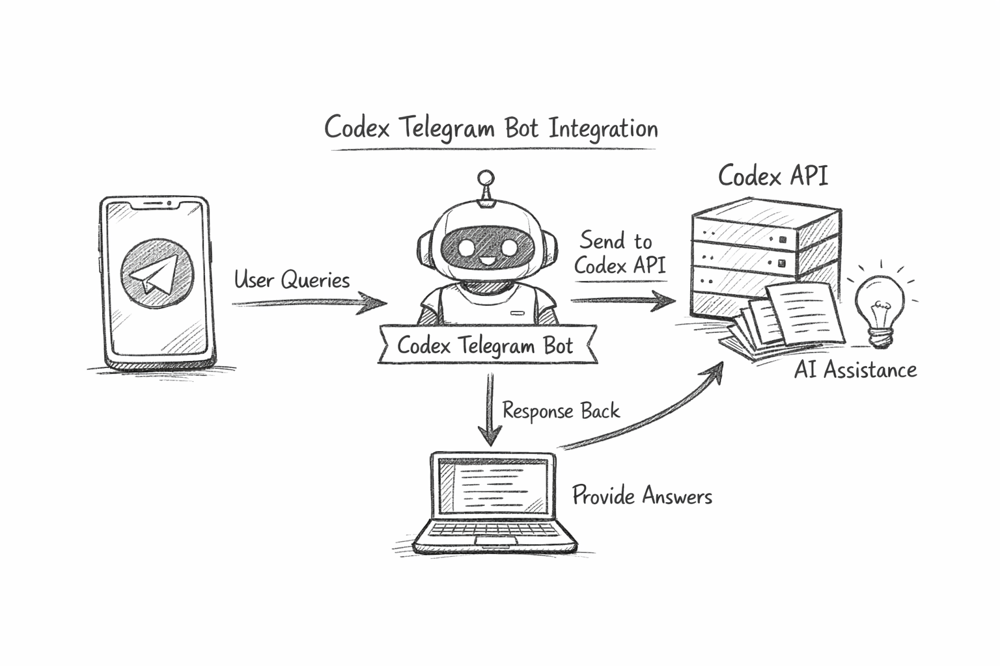

# Codex 텔레그램 봇

텔레그램에서 Codex App Server를 제어할 수 있는 봇입니다.



## 할 수 있는 일

- 텔레그램에서 Codex 명령을 실행하고 결과를 확인
- `allowed_ids` 기준으로 사용자 접근 제어
- 대화 수명주기 관리: 스레드 시작/재개/조회/보관
- 승인 요청 및 진행 이벤트를 텔레그램으로 실시간 전달

## 요구 사항

- Python `3.11+`
- Telegram Bot Token
- 설치 및 실행 가능한 `codex` CLI

## 빠른 시작

1. 의존성 설치

```bash
python3 -m pip install -r requirements.txt
```

2. 설정 파일 준비

```bash
cp conf.toml.example conf.toml
```

3. `conf.toml` 편집

- `projects.<key>.path`: 대상 프로젝트의 절대 경로
- `users.allowed_ids`: 이 봇 사용을 허용할 Telegram 사용자 ID 목록
- `bot.token` 또는 환경 변수 `TELEGRAM_BOT_TOKEN`

예시:

```toml
project = "default"

[projects.default]
name = "my project"
path = "/absolute/path/to/your/project"

[bot]
token = "TELEGRAM_BOT_TOKEN"
drop_pending_updates = true
conflict_action = "prompt" # prompt | kill | exit

[codex]
command = "codex"
args = ["app-server"]

[users]
allowed_ids = [123456789]

[approval]
mode = "interactive" # interactive | auto
auto_response = "approve" # approve | session | deny

[approval.guardian]
enabled = false
timeout_seconds = 8
failure_policy = "manual_fallback" # manual_fallback | deny | approve | session
explainability = "full_chain" # decision_only | summary | full_chain
apply_to_methods = ["*"]

[logging]
level = "INFO"

[forwarding]
app_server_event_level = "INFO"
app_server_event_allowlist = []
app_server_event_denylist = []

[[forwarding.rules]]
 method = "item/completed"
 require_path = "item.type"
 require_equals = "agentMessage"
 text_paths = ["item.text"]
 fallback = "drop"

[display]
max_message_length = 4000
send_progress = true
```

4. (선택) 환경 변수로 토큰 설정

```bash
export TELEGRAM_BOT_TOKEN="your_actual_bot_token"
```

5. 실행

```bash
python3 main.py
```

## 처음 실행 시 명령 순서

봇과 채팅을 시작한 뒤, 빠른 점검을 위해 아래 순서로 실행하세요.

1. `/commands` - 전체 명령어 보기
2. `/projects --list` - 프로젝트 프로필 보기
3. `/project <key|number|name>` - 활성 프로젝트 선택
4. `/start` - 새 스레드 시작

## 명령어 참조

| Telegram | Codex API | 설명 |
|----------|-----------|------|
| `/commands` | - | 사용 가능한 명령어 목록 |
| `/projects --list` | - | 설정된 프로젝트 목록 |
| `/projects --add <key>` | - | 인터랙티브 프로젝트 추가 절차 시작 |
| `/project <key\|number\|name>` | - | 활성 프로젝트 선택 |
| `/start` | thread/start | 새 스레드 생성 |
| `/resume <id\|number>` | thread/resume | 스레드 재개 (목록 번호 지원) |
| `/fork <id>` | thread/fork | 스레드 포크 |
| `/threads [--full] [--by-profile] [--current-profile] [--limit N] [--offset N] [--archived]` | thread/list | 페이징/전체 ID 옵션으로 스레드 목록 조회 |
| `/read <id\|number>` | thread/read | 스레드 읽기 (목록 번호 지원) |
| `/archive <id\|number>` | thread/archive | 스레드 보관 (목록 번호 지원) |
| `/unarchive <id>` | thread/unarchive | 스레드 보관 해제 |
| `/compact <id>` | thread/compact/start | 대화 이력 압축 |
| `/rollback <n>` | thread/rollback | 최근 N턴 롤백 |
| `/interrupt` | turn/interrupt | 실행 중인 턴 중단 |
| `/review` | review/start | 코드 리뷰 시작 |
| `/exec <cmd>` | command/exec | 명령어 실행 |
| `/models` | model/list | 사용 가능한 모델 목록 |
| `/features` | experimentalFeature/list + command/exec | 베타 기능 표시 및 체크박스 UI로 활성/비활성 적용 |
| `/gurdian` (`/guardian`) | local config | 가디언 설정 패널 표시 및 체크박스 UI로 변경 적용 |
| `/modes` | collaborationMode/list | 협업 모드 목록 |
| `/skills` | skills/list | 스킬 목록 |
| `/apps` | app/list | 앱 목록 |
| `/mcp` | mcpServerStatus/list | MCP 서버 목록 |
| `/config` | config/read | 설정 읽기 |

팁: 각 명령어의 상세 사용법은 `<command> --help`로 확인할 수 있습니다.

UI 참고:
- `Settings` 메뉴에는 `Features`, `Apps`, `Project Select`, `Guardian`, `Models`, `Modes`, `MCP`, `App Config`가 있습니다.

## 보안 참고 사항

- `users.allowed_ids`가 비어 있으면 아무도 봇을 사용할 수 없습니다.
- `conf.toml`에 토큰을 하드코딩하기보다 환경 변수 사용을 권장합니다.
- `approval.mode = "interactive"`일 때 승인은 텔레그램 버튼(Approve/Session/Deny)으로 처리됩니다.
- `approval.mode = "auto"`일 때는 `approval.auto_response` 값으로 즉시 결정이 반환됩니다.
- `approval.guardian.enabled`의 기본값은 `false`입니다.
- 가디언 설정은 텔레그램 `Settings -> Guardian`에서 변경하면 즉시 반영됩니다.
- 가디언 검토는 사용자 스레드와 분리된 Codex app-server 세션에서 실행됩니다.
- 봇 토큰당 폴링 인스턴스는 하나만 실행하세요. 중복 실행 시 충돌합니다.
- `bot.conflict_action`은 로컬 락 충돌 시 시작 동작을 제어합니다.
  - `prompt`: 터미널에서 선택 요청 (`kill` 또는 `exit`)
  - `kill`: 락 소유 프로세스를 종료한 뒤 계속 실행
  - `exit`: 즉시 종료

## 메시지 흐름

```text
Telegram User -> codex-telegram -> Codex App Server (stdio)
                ^                      |
                |                      v
                +------ Telegram <-----+
```

## 프로젝트 구조

```text
codex-telegram/
├── conf.toml.example
├── main.py
├── requirements.txt
├── bot/
│   ├── handlers.py
│   ├── callbacks.py
│   ├── keyboard.py
│   ├── thread_ui.py
│   ├── skills_ui.py
│   ├── projects_ui.py
│   └── guardian_ui.py
├── codex/
│   ├── client.py
│   ├── approval_guardian.py
│   ├── protocol.py
│   ├── events.py
│   └── commands.py
├── models/
│   ├── state.py
│   ├── thread.py
│   └── user.py
└── utils/
    ├── config.py
    └── logger.py
```

## Telegram Bot Token 발급

1. 텔레그램에서 `@BotFather` 열기
2. `/newbot` 실행
3. 봇 이름과 사용자명 설정
4. 발급된 토큰 복사
5. `@userinfobot`으로 본인 Telegram 사용자 ID를 확인해 `allowed_ids`에 추가

## 문서

- 설정 및 구성 상세: `docs/TELEGRAM_BOT_SETUP.md`
- 설계 노트: `docs/DESIGN.md`

## 라이선스

Apache License 2.0. 자세한 내용은 [LICENSE](LICENSE)를 참고하세요.
